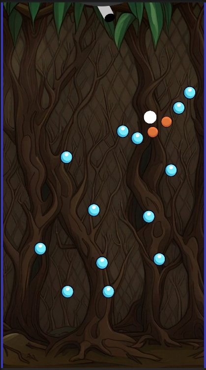

# Peggle-inspired 2D Game

A Peggle-inspired 2D game! This game is built using Unity3D and provides a delightful and challenging experience, combining elements of physics, puzzle-solving, and arcade gameplay. Aim, shoot, and bounce your way through an array of colorful pegs to achieve high scores and conquer each level!

## Future Features

- **Intuitive Gameplay**: Simple controls allow players of all ages to easily pick up and play.
- **Engaging Levels**: Enjoy a variety of meticulously designed levels, each with its own unique layout and challenges.
- **Physics-based Mechanics**: Experience realistic ball physics as your shots interact dynamically with pegs, obstacles, and walls.
- **Special Abilities**: Unleash powerful special abilities to gain an edge and strategically clear pegs.
- **High Score Challenge**: Compete against yourself and others to achieve the highest score on each level.
- **Level Editor**: Create and share your own levels using the built-in level editor, adding endless replayability to the game.

## Getting Started

### Prerequisites

- Unity3D: Ensure you have Unity3D installed on your machine. You can download it from the official Unity website: [https://unity.com](https://unity.com)

### Installation

1. Clone the repository or download the source code as a ZIP file.
2. Open Unity3D and click on "Open Project."
3. Select the folder where you cloned/downloaded the source code.
4. Once the project is open, navigate to the "Scenes" folder and double-click on the main scene to open it.

### Gameplay Instructions

- Aim your ball launcher using the mouse or touch controls.
- Left-click or tap to launch the ball.
- The ball will bounce off pegs and walls, aiming to clear all orange pegs before running out of balls.
- (TODO) Green pegs provide special abilities when hit. Activate them strategically to boost your score and clear pegs efficiently.
- (TODO) Earn extra balls and points by landing in the moving bucket at the bottom of the screen.
- (TODO) Complete each level to unlock the next one and challenge yourself to achieve higher scores.

## Development

### Unity3D Version

This game was developed using Unity3D version 2021.3.23f1 Make sure you have a compatible version to avoid any compatibility issues.

### Libraries and Assets

The following assets were used in the creation of this game:

- **[Peggle Font](https://www.dafont.com/peggle.font)** by [Allie Torkelson](https://www.dafont.com/)\: A font used for the game's logo and UI text.

### Contributing

We welcome contributions to enhance our game! To contribute, please follow these steps:

1. Fork the repository.
2. Create a new branch for your feature or bug fix.
3. Make your modifications and commit changes to your branch.
4. Push your branch to your forked repository.
5. Open a pull request, including a detailed description of your changes.

Please ensure your code adheres to our code style guidelines and that you have tested your changes thoroughly.

### License

This game is released under the [MIT License](LICENSE.md).

## Acknowledgements

We would like to express our gratitude to the following resources and individuals for their valuable contributions:

- The Unity3D community for their continuous support and shared knowledge.
- The developers of the open-source libraries and assets used in this project.

## Contact

If you have any questions, suggestions, or feedback, please feel free to reach out to us at [yoav@yoav.xyz](mailto:yoav@yoav.xyz). We would love to hear from you!

Enjoy the game!
